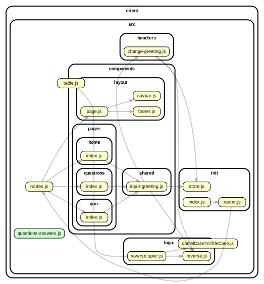

<!-- BEGIN TITLE -->

# DOCS

<!-- END TITLE -->

<!-- BEGIN TREE -->

> [interactive graph](./dependency-graph.html)

<!-- END TREE -->

<!-- BEGIN TOC -->

- components
  - layout
    - [footer.js](#srccomponentslayoutfooterjs)
    - [navbar.js](#srccomponentslayoutnavbarjs)
    - [page.js](#srccomponentslayoutpagejs)
  - pages
    - home
      - [index.js](#srccomponentspageshomeindexjs)
    - questions
      - [index.js](#srccomponentspagesquestionsindexjs)
    - quiz
      - [index.js](#srccomponentspagesquizindexjs)
  - shared
    - [input-greeting.js](#srccomponentssharedinput-greetingjs)
- handlers
  - [change-greeting.js](#srchandlerschange-greetingjs)
- init
  - [index.js](#srcinitindexjs)
  - [router.js](#srcinitrouterjs)
  - [state.js](#srcinitstatejs)
- logic
- [routes.js](#srcroutesjs)

---

<!-- END TOC -->

<!-- BEGIN DOCS -->

# /components

## /layout

<a href="../src/components/layout/footer.js" id="srccomponentslayoutfooterjs">src/components/layout/footer.js</a>

## footer ⇒ <code>HTMLDivElement</code>

The shared footer.

**Returns**: <code>HTMLDivElement</code> - A rendered footer element.

<a href="../src/components/layout/navbar.js" id="srccomponentslayoutnavbarjs">src/components/layout/navbar.js</a>

## navbar ⇒ <code>HTMLDivElement</code>

The shared navbar.

**Returns**: <code>HTMLDivElement</code> - A rendered nav bar element.

| Param  | Type                | Description                          |
| ------ | ------------------- | ------------------------------------ |
| routes | <code>object</code> | A routes object, see /src/routes.js. |

<a href="../src/components/layout/page.js" id="srccomponentslayoutpagejs">src/components/layout/page.js</a>

## page ⇒ <code>HTMLDivElement</code>

The page layout component.

**Returns**: <code>HTMLDivElement</code> - A rendered page element.  
**Throws**:

- <code>TypeError</code> When the bodyComponent is not a function or DOM element.

| Param         | Type                                              | Description                               |
| ------------- | ------------------------------------------------- | ----------------------------------------- |
| bodyComponent | <code>function</code> \| <code>HTMLElement</code> | The body for the newly rendered page.     |
| routes        | <code>object</code>                               | The application's routes, for the navbar. |

---

## /pages

### /home

<a href="../src/components/pages/home/index.js" id="srccomponentspageshomeindexjs">src/components/pages/home/index.js</a>

## home ⇒ <code>HTMLDivElement</code>

The home page.

**Returns**: <code>HTMLDivElement</code> - A rendered home page.

---

### /questions

<a href="../src/components/pages/questions/index.js" id="srccomponentspagesquestionsindexjs">src/components/pages/questions/index.js</a>

## questions ⇒ <code>HTMLDivElement</code>

The questions page.

**Returns**: <code>HTMLDivElement</code> - A rendered questions page.

---

### /quiz

<a href="../src/components/pages/quiz/index.js" id="srccomponentspagesquizindexjs">src/components/pages/quiz/index.js</a>

## quiz ⇒ <code>HTMLDivElement</code>

The quiz page.

**Returns**: <code>HTMLDivElement</code> - A rendered quiz page.

---

---

## /shared

<a href="../src/components/shared/input-greeting.js" id="srccomponentssharedinput-greetingjs">src/components/shared/input-greeting.js</a>

---

---

# /handlers

<a href="../src/handlers/change-greeting.js" id="srchandlerschange-greetingjs">src/handlers/change-greeting.js</a>

---

# /init

<a href="../src/init/index.js" id="srcinitindexjs">src/init/index.js</a>

<a href="../src/init/router.js" id="srcinitrouterjs">src/init/router.js</a>

<a href="../src/init/state.js" id="srcinitstatejs">src/init/state.js</a>

---

# /logic

---

<a href="../src/routes.js" id="srcroutesjs">src/routes.js</a>

## routes

Defines the route URLs, names and callbacks.

<!-- END DOCS -->
